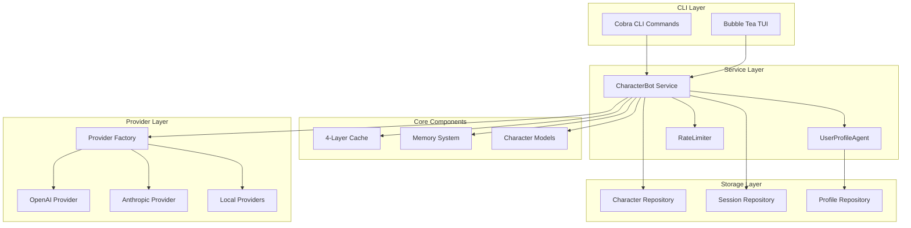
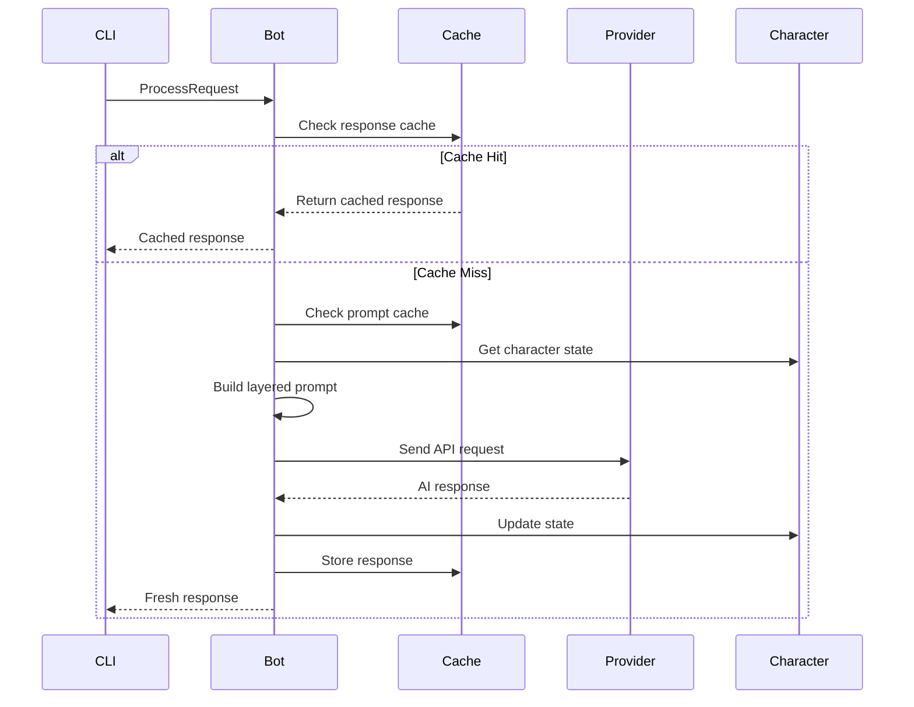
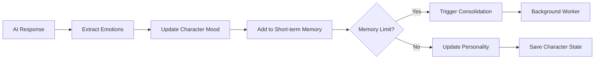

# 🏗️ Roleplay Architecture Guide

This document provides a comprehensive overview of the Roleplay system architecture, including design decisions, component interactions, and implementation details.

## 📋 Table of Contents

- [Overview](#overview)
- [System Architecture](#system-architecture)
- [4-Layer Caching System](#4-layer-caching-system)
- [Character System](#character-system)
- [Provider Abstraction](#provider-abstraction)
- [Memory Management](#memory-management)
- [Concurrency & Thread Safety](#concurrency--thread-safety)
- [Performance Optimization](#performance-optimization)
- [Data Flow](#data-flow)
- [Configuration System](#configuration-system)

## Overview

Roleplay is designed as a sophisticated character bot system that achieves 90% cost reduction through advanced prompt caching while maintaining psychological realism. The architecture follows clean architecture principles with clear separation of concerns.

### Core Design Principles

1. **Cost Optimization**: 4-layer caching strategy to minimize LLM API costs
2. **Psychological Realism**: OCEAN personality model with emotional intelligence
3. **Scalability**: Thread-safe operations with efficient memory management
4. **Flexibility**: Universal provider interface supporting multiple AI services
5. **Maintainability**: Clean architecture with clear boundaries

## System Architecture



### Package Structure

```
internal/
├── cache/              # 4-layer prompt caching system
│   ├── cache.go       # Core cache logic and TTL management
│   ├── response_cache.go # Response-level caching
│   └── types.go       # Cache layer definitions
├── config/            # Configuration management
│   └── config.go      # Config structures and validation
├── factory/           # Provider factory pattern
│   └── provider.go    # Centralized provider initialization
├── models/            # Domain models
│   ├── character.go   # Character with OCEAN personality
│   ├── conversation.go # Conversation context
│   └── user_profile.go # User profiling models
├── providers/         # AI provider implementations
│   ├── openai.go      # OpenAI provider
│   ├── types.go       # Provider interfaces
│   └── mock.go        # Testing provider
├── services/          # Core business logic
│   ├── bot.go         # Main CharacterBot service
│   ├── user_profile_agent.go # AI-powered user profiling
│   └── rate_limiter.go # Request rate limiting
├── repository/        # Data persistence
│   ├── character_repo.go # Character storage
│   ├── session_repo.go   # Session management
│   └── user_profile_repo.go # User profile storage
└── tui/               # Terminal UI components
    ├── model.go       # Main TUI model
    └── components/    # UI components
```

## 4-Layer Caching System

The caching system is the core innovation that achieves 90% cost reduction. It uses strategic layering aligned with prompt structure.

### Cache Layers

| Layer | Content | TTL | Hit Rate | Purpose |
|-------|---------|-----|----------|---------|
| **System** | Global instructions, safety guidelines | 24h+ | 95%+ | System-wide consistency |
| **Character** | Core personality, backstory, traits | 6-12h | 90%+ | Character identity |
| **User Context** | User-specific memories, relationships | 1-3h | 70%+ | Personalization |
| **Conversation** | Recent chat history | 5-15m | 40%+ | Immediate context |

### Cache Implementation

```go
// Core cache structure
type PromptCache struct {
    entries map[string]*CacheEntry
    mu      sync.RWMutex
    ttl     TTLManager
}

// Cache breakpoint for each layer
type CacheBreakpoint struct {
    Layer      CacheLayer    // Which cache layer
    Content    string        // Layer content
    TokenCount int           // Estimated tokens
    TTL        time.Duration // Time to live
    LastUsed   time.Time     // Access tracking
}
```

### Adaptive TTL Strategy

The cache uses intelligent TTL adaptation:

```go
func (pc *PromptCache) CalculateAdaptiveTTL(cached *CacheEntry, hasComplexCharacter bool) time.Duration {
    baseTTL := pc.ttl.BaseTTL
    
    // Active conversation bonus (50% extension)
    if cached != nil && time.Since(cached.LastAccess) < 5*time.Minute {
        baseTTL = time.Duration(float64(baseTTL) * 1.5)
    }
    
    // Character complexity bonus (20% extension)
    if hasComplexCharacter {
        baseTTL = time.Duration(float64(baseTTL) * 1.2)
    }
    
    return baseTTL
}
```

## Character System

### OCEAN Personality Model

The character system implements the scientifically-validated OCEAN (Big Five) personality model:

```go
type PersonalityTraits struct {
    Openness          float64 `json:"openness"`          // 0-1: Creativity, curiosity
    Conscientiousness float64 `json:"conscientiousness"` // 0-1: Organization, discipline
    Extraversion      float64 `json:"extraversion"`      // 0-1: Social energy
    Agreeableness     float64 `json:"agreeableness"`     // 0-1: Cooperation, trust
    Neuroticism       float64 `json:"neuroticism"`       // 0-1: Emotional instability
}
```

### Emotional Intelligence

Real-time emotional state tracking with 6 dimensions:

```go
type EmotionalState struct {
    Joy      float64 `json:"joy"`      // 0-1: Happiness, contentment
    Surprise float64 `json:"surprise"` // 0-1: Astonishment, wonder
    Anger    float64 `json:"anger"`    // 0-1: Frustration, rage
    Fear     float64 `json:"fear"`     // 0-1: Anxiety, worry
    Sadness  float64 `json:"sadness"`  // 0-1: Melancholy, grief
    Disgust  float64 `json:"disgust"`  // 0-1: Revulsion, contempt
}
```

### Personality Evolution

Characters evolve through bounded drift to prevent radical changes:

```go
func (cb *CharacterBot) evolvePersonality(char *Character, resp *AIResponse) {
    impacts := cb.analyzeInteractionImpacts(resp)
    driftRate := cb.config.PersonalityConfig.MaxDriftRate // 0.02 default
    
    // Apply bounded evolution
    char.Personality.Openness += impacts.Openness * driftRate
    // ... other traits
    
    // Normalize to keep traits in [0, 1] range
    char.Personality = models.NormalizePersonality(char.Personality)
}
```

## Provider Abstraction

### Universal Interface

All AI providers implement a common interface:

```go
type AIProvider interface {
    SendRequest(ctx context.Context, req *PromptRequest) (*AIResponse, error)
    SupportsBreakpoints() bool
    MaxBreakpoints() int
    Name() string
}
```

### Factory Pattern

Centralized provider creation eliminates code duplication:

```go
func CreateProvider(cfg *config.Config) (providers.AIProvider, error) {
    switch cfg.DefaultProvider {
    case "openai":
        return providers.NewOpenAIProvider(cfg.APIKey, cfg.Model), nil
    case "anthropic":
        return providers.NewAnthropicProvider(cfg.APIKey, cfg.Model), nil
    case "ollama":
        return providers.NewOllamaProvider(cfg.BaseURL, cfg.Model), nil
    default:
        return nil, fmt.Errorf("unsupported provider: %s", cfg.DefaultProvider)
    }
}
```

### Provider-Specific Optimizations

#### OpenAI Provider
- Automatic prompt caching for 1024+ token prompts
- Cached token tracking from API responses
- User parameter for cache routing optimization

#### Anthropic Provider  
- Custom prompt structuring for Claude models
- Fallback response caching when prompt caching unavailable

#### Local Providers (Ollama)
- No API key required
- Response caching to improve local model performance

## Memory Management

### Three-Tier Memory System

```go
const (
    ShortTermMemory  MemoryType = "short_term"  // Last 20 interactions
    MediumTermMemory MemoryType = "medium_term" // 24 hour duration
    LongTermMemory   MemoryType = "long_term"   // Permanent storage
)

type Memory struct {
    Type      MemoryType `json:"type"`
    Content   string     `json:"content"`
    Timestamp time.Time  `json:"timestamp"`
    Emotional float64    `json:"emotional_weight"` // 0-1 importance
}
```

### Automatic Consolidation

Background worker consolidates memories based on emotional significance:

```go
func (cb *CharacterBot) consolidateMemories(char *Character) {
    threshold := 0.7 // Emotional weight threshold
    
    for _, mem := range char.Memories {
        if mem.Type == ShortTermMemory && mem.Emotional > threshold {
            // Consolidate into medium-term memory
            consolidated := Memory{
                Type:      MediumTermMemory,
                Content:   cb.synthesizeMemories(emotionalMemories),
                Timestamp: time.Now(),
                Emotional: cb.averageEmotionalWeight(emotionalMemories),
            }
            char.Memories = append(char.Memories, consolidated)
        }
    }
}
```

## Concurrency & Thread Safety

### Character-Level Locking

Each character has its own mutex for fine-grained concurrency:

```go
type Character struct {
    // ... fields
    mu sync.RWMutex
}

func (c *Character) Lock() { c.mu.Lock() }
func (c *Character) RLock() { c.mu.RLock() }
```

### Cache Synchronization

The cache system uses read-write mutexes for optimal performance:

```go
type PromptCache struct {
    entries map[string]*CacheEntry
    mu      sync.RWMutex  // Allow concurrent reads
}

func (pc *PromptCache) Get(key string) (*CacheEntry, bool) {
    pc.mu.RLock()
    defer pc.mu.RUnlock()
    // ... safe read access
}
```

### Background Workers

- **Memory Consolidation**: Hourly worker processes character memories
- **Cache Cleanup**: Periodic removal of expired cache entries
- **Rate Limit Cleanup**: Cleanup of stale rate limiting buckets

## Performance Optimization

### Token Optimization

Prompts are structured to maximize cache efficiency:

```go
func (cb *CharacterBot) BuildPrompt(req *ConversationRequest) (string, []CacheBreakpoint, error) {
    // Layer 1: System instructions (static, long TTL)
    systemPrompt := cb.buildSystemPrompt()
    
    // Layer 2: Character core (static, long TTL)  
    characterPrompt := cb.buildCoreCharacterSystemPrompt(char)
    
    // Layer 3: User context (semi-static, medium TTL)
    userContext := cb.buildUserContext(req.UserID, char)
    
    // Layer 4: Conversation (dynamic, short TTL)
    conversation := cb.buildConversationHistory(req.Context)
    
    return cb.assemblePrompt(breakpoints, req.UserID, req.Message)
}
```

### Rate Limiting

Smart rate limiting prevents cache overflow:

```go
type RateLimiter struct {
    buckets map[string]*bucket  // "userID:characterID" -> bucket
    maxRate int                 // 14 requests/minute (below OpenAI's 15)
    window  time.Duration       // 1 minute window
}
```

### Response Deduplication

Identical requests return cached responses immediately:

```go
func (cb *CharacterBot) ProcessRequest(ctx context.Context, req *ConversationRequest) (*AIResponse, error) {
    // Check response cache first
    responseCacheKey := cb.responseCache.GenerateKey(req.CharacterID, req.UserID, req.Message)
    if cachedResp, found := cb.responseCache.Get(responseCacheKey); found {
        cb.cacheHits++
        return cachedResp, nil
    }
    // ... proceed with API call
}
```

## Data Flow

### Conversation Request Flow



### Character State Updates



## Configuration System

### Hierarchical Configuration

Settings are resolved in this priority order:

1. **Command Flags**: `--api-key`, `--model`, `--provider`
2. **Environment Variables**: `ROLEPLAY_API_KEY`, `OPENAI_API_KEY`
3. **Config File**: `~/.config/roleplay/config.yaml`
4. **Default Values**: Sensible fallbacks

### Configuration Structure

```yaml
# Provider settings
provider: openai
api_key: sk-your-key
model: gpt-4o-mini
base_url: https://api.openai.com/v1

# Cache configuration
cache:
  max_entries: 10000
  cleanup_interval: 5m
  default_ttl: 10m
  adaptive_ttl: true
  core_character_system_prompt_ttl: 168h # 7 days

# Memory system
memory:
  short_term_window: 20
  medium_term_duration: 24h
  consolidation_rate: 0.1

# Personality evolution
personality:
  evolution_enabled: true
  max_drift_rate: 0.02
  stability_threshold: 10

# User profiling
user_profile:
  enabled: true
  update_frequency: 5
  turns_to_consider: 20
  confidence_threshold: 0.5
  prompt_cache_ttl: 1h
```

## Key Design Decisions

### Why 4-Layer Caching?

The 4-layer approach maximizes cache efficiency by aligning with natural prompt structure:

1. **System layer** - Global instructions that never change
2. **Character layer** - Stable personality traits  
3. **User layer** - Evolving but persistent relationships
4. **Conversation layer** - Dynamic immediate context

### Why OCEAN Personality Model?

The Big Five (OCEAN) model is scientifically validated and provides:
- Comprehensive personality coverage
- Quantifiable traits (0-1 scale)
- Research-backed emotional correlations
- Realistic personality evolution patterns

### Why Universal Provider Interface?

A single OpenAI-compatible interface:
- Reduces code complexity and maintenance
- Enables easy provider switching
- Supports emerging OpenAI-compatible services
- Simplifies testing and mocking

### Why Factory Pattern?

Centralized provider creation:
- Eliminates code duplication
- Ensures consistent initialization
- Simplifies configuration management
- Supports runtime provider selection

## Performance Characteristics

### Cache Performance
- **Hit Rate**: 70-95% depending on layer
- **Cost Reduction**: Up to 90% in API costs
- **Latency Reduction**: Up to 80% for cached responses
- **Memory Usage**: ~10MB for 10,000 cache entries

### Concurrency
- **Thread Safety**: Full thread-safe operations
- **Scalability**: Handles multiple concurrent conversations
- **Resource Usage**: Minimal lock contention with fine-grained mutexes

### Memory Management
- **Memory Consolidation**: Automatic background processing
- **Character Storage**: Efficient JSON serialization
- **Cache Cleanup**: Periodic garbage collection of expired entries

This architecture enables Roleplay to deliver cost-effective, psychologically realistic AI characters while maintaining high performance and reliability.