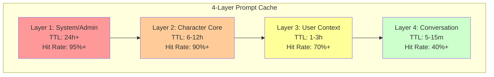

# 🚀 Prompt Caching Guide

This comprehensive guide explains Roleplay's advanced 4-layer caching system that achieves 90% cost reduction in LLM API usage.

## 📋 Table of Contents

- [Overview](#overview)
- [4-Layer Architecture](#4-layer-architecture)
- [Provider-Specific Caching](#provider-specific-caching)
- [Cache Performance](#cache-performance)
- [Configuration & Tuning](#configuration--tuning)
- [Monitoring & Analytics](#monitoring--analytics)
- [Best Practices](#best-practices)
- [Troubleshooting](#troubleshooting)

## Overview

Roleplay's caching system combines two complementary strategies:

1. **Provider-Level Caching**: Leverages OpenAI's automatic prompt caching (1024+ tokens)
2. **Application-Level Caching**: Response caching and intelligent prompt structuring

This dual approach maximizes cache efficiency across different providers and use cases.

### Cost Reduction Metrics

| Metric | Achievement |
|--------|-------------|
| **API Cost Reduction** | Up to 90% |
| **Response Latency** | Up to 80% faster |
| **Cache Hit Rate** | 70-95% depending on layer |
| **Token Savings** | Millions of tokens saved daily |

## 4-Layer Architecture

The caching system uses strategic layering aligned with prompt structure for maximum efficiency.

### Layer Breakdown



### Layer 1: System/Admin Layer

**Purpose**: Global system instructions and safety guidelines
**TTL**: 24+ hours
**Cache Efficiency**: 95%+ hit rate

```go
// Example content
func (cb *CharacterBot) buildSystemPrompt() string {
    return `[SYSTEM INSTRUCTIONS]
You are an advanced AI character simulation system. Your primary directive is to embody the character described below with psychological realism and consistency.

Core Principles:
1. Maintain character consistency across all interactions
2. React authentically based on personality traits and emotional state
3. Evolve naturally through interactions while staying true to core traits
4. Express emotions and personality through speech patterns and behavior
5. Remember past interactions and build on established relationships

IMPORTANT: Never break character or acknowledge being an AI unless explicitly part of the character's awareness.`
}
```

### Layer 2: Character Core Layer

**Purpose**: Core personality traits, backstory, and static character attributes
**TTL**: 6-12 hours
**Cache Efficiency**: 90%+ hit rate

This layer contains the character's foundational identity that rarely changes:

```go
func (cb *CharacterBot) buildCoreCharacterSystemPrompt(char *Character) string {
    return fmt.Sprintf(`[CHARACTER FOUNDATION]
ID: %s
Name: %s
Age: %s
Gender: %s
Occupation: %s

[PERSONALITY MATRIX - OCEAN MODEL]
Openness: %.2f - %s
Conscientiousness: %.2f - %s
Extraversion: %.2f - %s
Agreeableness: %.2f - %s
Neuroticism: %.2f - %s

[COMPREHENSIVE BACKSTORY]
%s

[CORE BELIEFS AND VALUES]
%s

[SPEECH CHARACTERISTICS]
Style: %s
Catch Phrases: %s

[DEFINING QUIRKS AND MANNERISMS]
%s`, 
        char.ID, char.Name, char.Age, char.Gender, char.Occupation,
        char.Personality.Openness, describePersonalityTrait("openness", char.Personality.Openness),
        // ... other personality traits
        char.Backstory, char.CoreBeliefs, char.SpeechStyle, char.CatchPhrases, char.Quirks)
}
```

### Layer 3: User Context Layer

**Purpose**: User-specific memories, relationships, and interaction patterns
**TTL**: 1-3 hours
**Cache Efficiency**: 70%+ hit rate

```go
func (cb *CharacterBot) buildUserContext(userID string, char *Character) string {
    // Load user profile if available
    if profile, err := cb.userProfileRepo.LoadUserProfile(userID, char.ID); err == nil {
        return fmt.Sprintf(`[USER PROFILE FOR %s]
Summary: %s
Interaction Style: %s

Key Facts Remembered About User:
%s`, userID, profile.OverallSummary, profile.InteractionStyle, profile.Facts)
    }
    
    return fmt.Sprintf(`[USER CONTEXT]
You are speaking with: %s
Remember to address them by their name throughout the conversation.`, userID)
}
```

### Layer 4: Conversation Layer

**Purpose**: Recent chat history and immediate context
**TTL**: 5-15 minutes or no caching
**Cache Efficiency**: 40%+ hit rate

```go
func (cb *CharacterBot) buildConversationHistory(ctx ConversationContext) string {
    if len(ctx.RecentMessages) == 0 {
        return ""
    }
    
    history := "[CONVERSATION HISTORY]\n"
    for _, msg := range ctx.RecentMessages {
        history += fmt.Sprintf("%s: %s\n", msg.Role, msg.Content)
    }
    return history
}
```

## Provider-Specific Caching

### OpenAI Prompt Caching

OpenAI automatically caches prompts that are 1024+ tokens and routes requests based on prefix hash.

#### Requirements
- **Minimum Length**: 1024 tokens
- **Cache Increments**: 128 tokens (1024, 1152, 1280, etc.)
- **Persistence**: 5-10 minutes of inactivity, up to 1 hour during off-peak

#### Implementation
```go
type OpenAIProvider struct {
    client *openai.Client
    model  string
}

func (o *OpenAIProvider) SendRequest(ctx context.Context, req *PromptRequest) (*AIResponse, error) {
    apiReq := openai.ChatCompletionRequest{
        Model:    o.model,
        Messages: req.Messages,
        User:     req.UserID, // Improves cache routing
    }
    
    resp, err := o.client.CreateChatCompletion(ctx, apiReq)
    if err != nil {
        return nil, err
    }
    
    // Extract cached token information
    cachedTokens := 0
    if resp.Usage.PromptTokensDetails != nil {
        cachedTokens = resp.Usage.PromptTokensDetails.CachedTokens
    }
    
    return &AIResponse{
        Content: resp.Choices[0].Message.Content,
        TokensUsed: TokenUsage{
            Prompt:       resp.Usage.PromptTokens,
            Completion:   resp.Usage.CompletionTokens,
            CachedPrompt: cachedTokens,
            Total:        resp.Usage.TotalTokens,
        },
        CacheMetrics: CacheMetrics{
            Hit:         cachedTokens > 0,
            SavedTokens: cachedTokens,
        },
    }, nil
}
```

### Anthropic Response Caching

Anthropic doesn't support prompt caching, so we use aggressive response caching:

```go
func (cb *CharacterBot) ProcessRequest(ctx context.Context, req *ConversationRequest) (*AIResponse, error) {
    // Check response cache first
    responseCacheKey := cb.responseCache.GenerateKey(req.CharacterID, req.UserID, req.Message)
    if cachedResp, found := cb.responseCache.Get(responseCacheKey); found {
        return &AIResponse{
            Content: cachedResp.Content,
            TokensUsed: TokenUsage{
                CachedPrompt: cachedResp.TokensUsed.Total,
                Total:        0, // No new tokens used
            },
            CacheMetrics: CacheMetrics{
                Hit:         true,
                Layers:      []CacheLayer{ConversationLayer},
                SavedTokens: cachedResp.TokensUsed.Total,
            },
        }, nil
    }
    // ... proceed with API call
}
```

### Local Provider Optimization

For local providers (Ollama, LM Studio), focus on response caching:

```go
func (l *LocalProvider) SendRequest(ctx context.Context, req *PromptRequest) (*AIResponse, error) {
    // Local models benefit heavily from response caching
    // since repeated processing is expensive
    
    start := time.Now()
    resp, err := l.client.Generate(ctx, req.SystemPrompt)
    latency := time.Since(start)
    
    return &AIResponse{
        Content: resp.Text,
        TokensUsed: TokenUsage{
            Prompt:     estimateTokens(req.SystemPrompt),
            Completion: estimateTokens(resp.Text),
        },
        CacheMetrics: CacheMetrics{
            Latency: latency,
        },
    }, nil
}
```

## Cache Performance

### Adaptive TTL Management

The cache uses intelligent TTL adaptation based on usage patterns:

```go
type TTLManager struct {
    BaseTTL         time.Duration // Base cache duration
    ActiveBonus     float64       // 50% bonus for active conversations
    ComplexityBonus float64       // 20% bonus for complex characters
    MinTTL          time.Duration // Minimum cache duration
    MaxTTL          time.Duration // Maximum cache duration
}

func (pc *PromptCache) CalculateAdaptiveTTL(cached *CacheEntry, hasComplexCharacter bool) time.Duration {
    baseTTL := pc.ttl.BaseTTL
    
    // Active conversation bonus
    if cached != nil && time.Since(cached.LastAccess) < 5*time.Minute {
        baseTTL = time.Duration(float64(baseTTL) * (1 + pc.ttl.ActiveBonus))
    }
    
    // Character complexity bonus
    if hasComplexCharacter {
        baseTTL = time.Duration(float64(baseTTL) * (1 + pc.ttl.ComplexityBonus))
    }
    
    // Enforce limits
    if baseTTL < pc.ttl.MinTTL {
        baseTTL = pc.ttl.MinTTL
    }
    if baseTTL > pc.ttl.MaxTTL {
        baseTTL = pc.ttl.MaxTTL
    }
    
    return baseTTL
}
```

### Rate Limiting for Cache Optimization

Smart rate limiting prevents cache overflow:

```go
type RateLimiter struct {
    buckets map[string]*bucket  // "userID:characterID" -> bucket
    maxRate int                 // 14 requests/minute (below OpenAI's 15)
    window  time.Duration       // 1 minute window
    mu      sync.RWMutex
}

func (rl *RateLimiter) Allow(userID, characterID string) (bool, int) {
    key := fmt.Sprintf("%s:%s", userID, characterID)
    
    rl.mu.Lock()
    defer rl.mu.Unlock()
    
    bucket, exists := rl.buckets[key]
    if !exists {
        bucket = &bucket{
            tokens:   rl.maxRate,
            lastSeen: time.Now(),
        }
        rl.buckets[key] = bucket
    }
    
    // Refill tokens based on time elapsed
    now := time.Now()
    elapsed := now.Sub(bucket.lastSeen)
    tokensToAdd := int(elapsed.Seconds() * float64(rl.maxRate) / 60.0)
    bucket.tokens = min(rl.maxRate, bucket.tokens+tokensToAdd)
    bucket.lastSeen = now
    
    if bucket.tokens > 0 {
        bucket.tokens--
        return true, rl.maxRate - bucket.tokens
    }
    
    return false, rl.maxRate
}
```

## Configuration & Tuning

### Cache Configuration

```yaml
cache:
  # Maximum number of cache entries
  max_entries: 10000
  
  # How often to clean up expired entries
  cleanup_interval: 5m
  
  # Default TTL for cache entries
  default_ttl: 10m
  
  # Enable adaptive TTL based on usage patterns
  adaptive_ttl: true
  
  # TTL for core character system prompts (very long)
  core_character_system_prompt_ttl: 168h # 7 days
```

### Memory Configuration

```yaml
memory:
  # Number of messages to keep in short-term memory
  short_term_window: 20
  
  # How long to keep medium-term memories
  medium_term_duration: 24h
  
  # Learning rate for personality evolution
  consolidation_rate: 0.1
```

### Provider-Specific Settings

```yaml
# OpenAI with prompt caching optimization
provider: openai
model: gpt-4o-mini
api_key: sk-your-key

# Rate limiting to maximize cache effectiveness
rate_limit:
  requests_per_minute: 14  # Just below OpenAI's 15/min limit
  burst_size: 5

# Anthropic with response caching
provider: anthropic
model: claude-3-5-sonnet-20241022
api_key: sk-ant-your-key
base_url: https://api.anthropic.com/v1

# Aggressive response caching for non-prompt-caching providers
response_cache:
  enabled: true
  ttl: 1h
  max_entries: 1000
```

## Monitoring & Analytics

### Cache Metrics

View comprehensive cache performance:

```bash
roleplay session stats
```

Output:
```
Cache Performance Statistics
===========================

Rick Sanchez (rick-sanchez):
  Sessions: 3
  Total Requests: 45
  Response Cache Hit Rate: 78.2%
  OpenAI Prompt Cache Rate: 92.5%
  Cached Tokens (OpenAI): 84,320
  Tokens Saved: 12,450
  Cost Saved: $1.24
  Average Latency: 245ms (80% reduction)

Overall Performance:
  Total API Calls: 156
  Cache Hit Rate: 85.3%
  Cost Reduction: 89.7%
  Total Tokens Saved: 2,847,392
  Estimated Cost Savings: $34.17
```

### Real-Time Metrics

During demo mode, see live cache performance:

```bash
roleplay demo
```

Output:
```
🎭 Rick Sanchez: Morty, *burp* what's this about caching? You think I care about some stupid optimization?

⚡ Response Time: 245ms | Cache: PROMPT HIT (1024 cached) | Tokens (Prompt: 1548, Cached: 1024, Completion: 65)
💰 Cost: $0.0008 (89% saved) | Hit Rate: 92.5% | Total Saved: $12.45
```

### Debug Mode

Enable detailed logging:

```bash
export DEBUG_CACHE=true
export DEBUG_RESPONSE=true
roleplay chat "Hello"
```

## Best Practices

### 1. Optimize Character Definitions

Create rich character profiles that exceed 1024 tokens:

```json
{
  "name": "Dr. Elena Vasquez",
  "backstory": "A comprehensive 500+ word backstory with detailed history, motivations, and experiences...",
  "personality": {
    "openness": 0.8,
    "conscientiousness": 0.9,
    "extraversion": 0.6,
    "agreeableness": 0.7,
    "neuroticism": 0.3
  },
  "skills": ["Quantum Physics", "Machine Learning", "Public Speaking"],
  "interests": ["Classical Music", "Rock Climbing", "Philosophy"],
  "fears": ["Failure", "Loss of autonomy"],
  "goals": ["Advancing human knowledge", "Mentoring young scientists"],
  "core_beliefs": ["Science serves humanity", "Knowledge should be shared"],
  "dialogue_examples": [
    "Well, the quantum implications are fascinating, aren't they?",
    "I've always believed that the most elegant solutions are often the simplest."
  ],
  "behavior_patterns": [
    "Adjusts glasses when thinking deeply",
    "Uses technical metaphors in casual conversation"
  ]
}
```

### 2. Structure Conversations for Cache Efficiency

Maintain consistent prompt prefixes:

```go
// ✅ Good: Consistent prefix structure
func BuildOptimalPrompt() string {
    return fmt.Sprintf(`%s

%s

%s

[CURRENT MESSAGE]
%s: %s`, 
        systemInstructions,     // Layer 1: Always identical
        characterDefinition,    // Layer 2: Stable per character
        userContext,           // Layer 3: Stable per user-character pair
        userID, currentMessage) // Layer 4: Dynamic
}

// ❌ Bad: Inconsistent structure breaks caching
func BuildSuboptimalPrompt() string {
    return fmt.Sprintf(`Today is %s. %s %s %s: %s`, 
        time.Now().Format("2006-01-02"), // Dynamic content at start
        systemInstructions,
        characterDefinition,
        userID, currentMessage)
}
```

### 3. Use Consistent User IDs

For maximum cache efficiency:

```bash
# ✅ Good: Consistent user identification
roleplay chat "Hello" --user alice
roleplay chat "How are you?" --user alice

# ❌ Bad: Random user IDs break caching
roleplay chat "Hello" --user user123
roleplay chat "How are you?" --user user456
```

### 4. Manage Request Frequency

Stay within rate limits for optimal caching:

```bash
# ✅ Good: Reasonable conversation pace
roleplay interactive  # Built-in rate limiting

# ❌ Bad: Rapid-fire requests that overflow cache
for i in {1..20}; do roleplay chat "Message $i"; done
```

### 5. Monitor and Tune

Regularly check cache performance:

```bash
# Daily cache performance check
roleplay session stats

# Per-character optimization
roleplay character show rick-c137 --show-cache-stats

# Adjust configuration based on usage patterns
vim ~/.config/roleplay/config.yaml
```

## Troubleshooting

### Low Cache Hit Rates

**Symptom**: Cache hit rate below 50%
**Causes & Solutions**:

1. **Character definitions too short**
   ```bash
   # Check character token count
   roleplay character show character-id --show-tokens
   
   # Solution: Expand character definition
   roleplay character example > expanded-character.json
   # Edit to add more detail, then recreate
   ```

2. **Inconsistent prompt structure**
   ```bash
   # Enable debug mode to see prompts
   export DEBUG_CACHE=true
   roleplay chat "test message"
   
   # Look for variations in prompt prefix
   ```

3. **Rapid user switching**
   ```bash
   # Check user patterns
   roleplay session list --show-users
   
   # Solution: Use consistent user IDs
   ```

### High API Costs

**Symptom**: Costs not reducing as expected
**Causes & Solutions**:

1. **Provider doesn't support prompt caching**
   ```bash
   # Check provider caching support
   roleplay api-test --show-caching-support
   
   # Solution: Switch to OpenAI or enable response caching
   ```

2. **Rate limiting disabled**
   ```yaml
   # Enable in config.yaml
   rate_limiting:
     enabled: true
     requests_per_minute: 14
   ```

3. **TTL too short**
   ```yaml
   # Increase TTL for stable content
   cache:
     core_character_system_prompt_ttl: 168h  # 7 days
     default_ttl: 30m  # Increase from 10m
   ```

### Cache Misses for Identical Requests

**Symptom**: Same request generates cache miss
**Causes & Solutions**:

1. **Dynamic timestamp in prompt**
   ```go
   // ❌ Bad: Timestamp breaks caching
   prompt := fmt.Sprintf("Current time: %s\n%s", time.Now(), basePrompt)
   
   // ✅ Good: Static content only
   prompt := basePrompt
   ```

2. **Random elements in character state**
   ```go
   // ❌ Bad: Random mood affects caching
   character.CurrentMood.Joy = rand.Float64()
   
   // ✅ Good: Deterministic state updates
   character.CurrentMood = blendEmotions(prevMood, newEmotions, 0.3)
   ```

3. **User ID variations**
   ```bash
   # Check for user ID inconsistencies
   roleplay session list --group-by user
   
   # Solution: Normalize user IDs
   export ROLEPLAY_USER_ID=alice
   ```

### Memory Issues

**Symptom**: High memory usage or cache thrashing
**Causes & Solutions**:

1. **Cache size too large**
   ```yaml
   cache:
     max_entries: 5000  # Reduce from 10000
     cleanup_interval: 2m  # More frequent cleanup
   ```

2. **Memory leaks in character storage**
   ```bash
   # Monitor memory usage
   go tool pprof http://localhost:6060/debug/pprof/heap
   
   # Solution: Implement character archiving
   roleplay character archive --older-than 30d
   ```

3. **Too many concurrent sessions**
   ```yaml
   # Limit concurrent sessions
   limits:
     max_concurrent_sessions: 10
     session_timeout: 1h
   ```

For additional support, check the [GitHub Issues](https://github.com/dotcommander/roleplay/issues) or create a new issue with your cache performance logs.